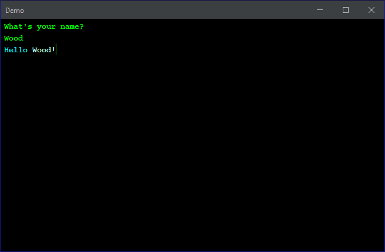

A T-UI (text user interface) API with color support.

Basic usage:
```java
FlatLafWrapper.customizeLaf(); // apply a dark theme to the frame using the flatlaf library

String frameTitle = "Demo";
boolean resetColorAfterMsg = true; // if the text's color should be reset after each message

TuiFrame console = new TuiFrame.Builder(frameTitle, resetColorAfterMsg).build();

console.println("What's your name?");
// take input from the user
String name = console.nextLine();
// printf() mimics System.out.printf() with the addition that Color objects will be encoded as Strings
console.printf("%sHello%s %s!", Color.cyan, Colors.magicMint, name);
```
Result:



*Dependency:*

[Flatlaf 2.3](https://github.com/JFormDesigner/FlatLaf)

