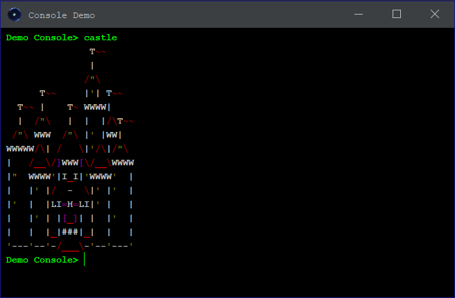

A Java terminal emulator using Swing; for a usage demo, see the DemoConsole class.

*Using the terminal:*

Use the up & down arrow keys to cycle through previous commands. You can copy/paste text into the terminal.
Press tab for autocomplete. You cannot edit previously entered lines or text output from the console (i.e. the prompt).

*Dependency:*

[Flatlaf 2.3](https://github.com/JFormDesigner/FlatLaf)

